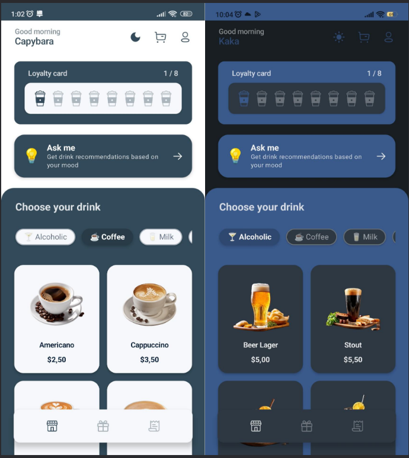
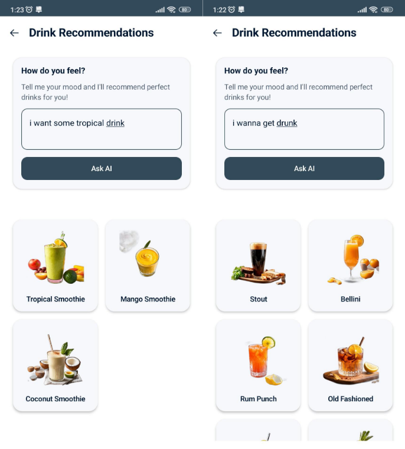
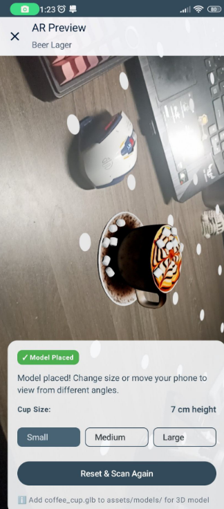

# coffee-booking-app 

This module contains the client-side Android app UI and core client logic for a coffee booking experience. Below is a brief app overview, the tech stack used, and focused descriptions of two highlight features: the AI-based recommendation system and the AR view for metric-scale drink previews. Also included: account management via Firebase.

## App overview

The app is an Android client that lets users browse drinks and products, view details (including AR previews), add items to a cart, check out, and manage orders and rewards. The UI is built with Jetpack Compose and follows modern Android architecture patterns to keep UI, state, and business logic well separated.

Key user flows:
- Discover and browse drinks
- Read product details and view a metric-scale AR preview
- Get AI-powered drink recommendations from simple natural-language input
- Sign up / sign in and persist user-specific orders and rewards via Firebase

## Tech stack

- Kotlin + Jetpack Compose for UI
- MVVM architecture (ViewModels + Repository as SSOT)
- Firebase for Authentication and optional data (Authentication, Firestore/Realtime DB can be plugged if needed)
- ARCore-compatible assets and AR rendering pipeline (model files in `src/main/assets/models`)
- Optional AI/ML integration (remote API or local model) for recommendations

## AI: Smart Drink Recommendation (feature)

Short description
- Let users type natural-language requests (e.g., "low-caffeine iced almond milk, <250 kcal") and receive ranked drink suggestions.

Why it’s useful
- Natural input and quick personalization: matches user mood, dietary needs, and past likes for tailored results.

How it works (summary)
- Lightweight NLP extracts attributes from text, scores menu items by match + context (time, availability), and re-ranks using user history when available. A simple local fallback runs offline.

## AR view: Metric-scale 3D Drink Preview (feature)

Short description
- Place a metric-accurate 3D model of the drink in the user’s environment to estimate real-world size and proportions.

Why it’s useful
- Helps users visually judge portion size and make confident ordering decisions.

How it works (summary)
- Models include physical dimensions and are scaled in AR using ARCore plane detection. The view shows a simple ruler overlay and numeric readout (cm/inches); a compare mode allows side-by-side previews.

## Account management (Firebase)

- Authentication: Firebase Authentication manages sign-up, sign-in, password reset, and simple social providers if enabled (Google, Facebook).
- User data: when signed in, user orders, reward points, and redeemed vouchers can be synced to a cloud store (Firestore or Realtime DB). In this module, Authentication is wired and the repository can be extended to persist data.

